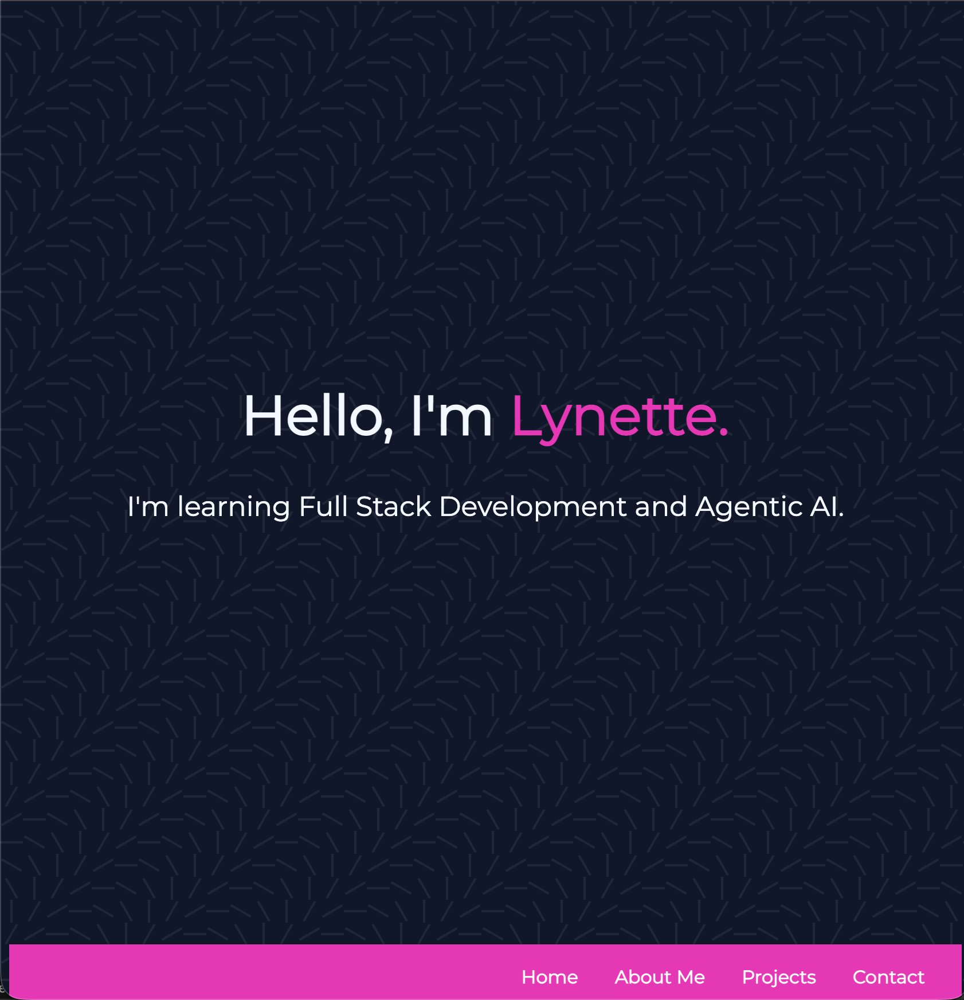

# 🌐 Lynette Siew — Portfolio Website

Welcome to my personal portfolio!  
This site was built using **HTML**, **CSS**, and **responsive design principles** to showcase my journey in **Full Stack Development** and **Agentic AI**.

---

## 🚀 Live Demo
🔗 [View My Portfolio](https://lynettesiew.github.io/portfolio/)

---

## 🛠️ Built With
| Technology | Description |
|-------------|--------------|
| 💻 **HTML5** | Semantic, accessible markup |
| 🎨 **CSS3** | Flexbox, Grid, Media Queries |
| 🌈 **Google Fonts (Montserrat)** | Clean, modern typography |
| 🧠 **Responsive Design** | Optimized for desktop, tablet, and mobile |

---

## 📸 Preview

---

## 📬 Contact
💌 Email: [youremail@example.com](mailto:youremail@example.com)  
🌐 Website: [lynettesiew.github.io/portfolio](https://lynettesiew.github.io/portfolio)

---

### 📝 Notes
- Built as part of my **Full Stack Developer training**
- Designed with a focus on **minimal, modern, and clean layout**
- Future updates will include JavaScript interactions and backend form handling
